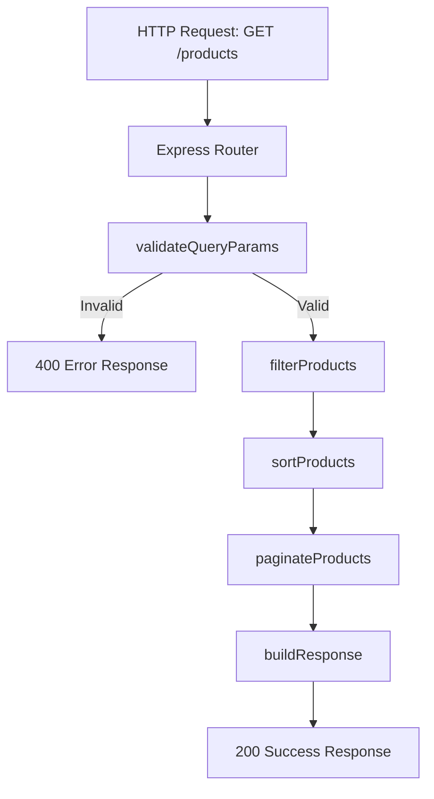

# Design Document: Product Listing Endpoint

## Overview

This design describes the implementation of a `GET /products` REST endpoint for the existing Express/TypeScript API. The endpoint supports filtering (by category and price range), sorting (by name or price), and pagination (limit/offset) over an in-memory product dataset.

The implementation follows a pipeline architecture: **validate → filter → sort → paginate → respond**. Each step is handled by a dedicated pure function, making the logic easy to test in isolation and compose together.

## Architecture



### Design Decisions

1. **Pure function pipeline**: Each processing step (validate, filter, sort, paginate) is a pure function that takes input and returns output without side effects. This enables straightforward unit testing and property-based testing.

2. **Single route handler with service delegation**: The Express route handler acts as an orchestrator, calling into service functions. This keeps the route thin and testable.

3. **Existing types reused**: The project already defines `ProductQueryParams`, `ValidationResult`, `PaginationMetadata`, `ProductListResponse`, and `ProductErrorResponse` in `src/types/productTypes.ts`. The implementation will conform to these interfaces.

4. **In-memory data source**: Products are sourced from `src/database/products.ts`. The service functions accept a product array parameter so they can be tested with arbitrary data.

## Components and Interfaces

### File Structure

```
src/
├── routes/
│   └── products.ts          # Express Router with GET / handler
├── services/
│   └── productService.ts    # Pure functions: validate, filter, sort, paginate
├── database/
│   └── products.ts          # Existing in-memory data
├── types/
│   └── productTypes.ts      # Existing type definitions
└── app.ts                   # Mount new products router
```

### Component: `productService.ts`

Contains the core logic as exportable pure functions:

```typescript
// Validates raw query string params, returns ValidationResult
export function validateQueryParams(query: Record<string, unknown>): ValidationResult;

// Filters products by category and/or price range
export function filterProducts(products: Product[], params: ProductQueryParams): Product[];

// Sorts products by the specified field and order, with id tiebreaker
export function sortProducts(products: Product[], params: ProductQueryParams): Product[];

// Applies offset/limit and computes pagination metadata
export function paginateProducts(products: Product[], params: ProductQueryParams): {
  data: Product[];
  metadata: PaginationMetadata;
};
```

### Component: `products.ts` (route)

```typescript
import { Router, Request, Response } from 'express';
import { products } from '../database/products';
import { validateQueryParams, filterProducts, sortProducts, paginateProducts } from '../services/productService';

export const productsRouter = Router();

productsRouter.get('/', (req: Request, res: Response) => {
  // 1. Validate
  const validation = validateQueryParams(req.query);
  if (!validation.success) {
    return res.status(400).json({ error: formatErrors(validation.errors) });
  }
  // 2. Filter → Sort → Paginate
  const filtered = filterProducts(products, validation.params);
  const sorted = sortProducts(filtered, validation.params);
  const result = paginateProducts(sorted, validation.params);
  // 3. Respond
  return res.status(200).json(result);
});
```

### Integration with `app.ts`

```typescript
import { productsRouter } from './routes/products';
app.use('/products', productsRouter);
```

## Data Models

All types are already defined in `src/types/productTypes.ts`. Here's the model summary:

### Product (from `src/database/products.ts`)

| Field       | Type   | Description                    |
|-------------|--------|--------------------------------|
| id          | string | Unique identifier              |
| name        | string | Product name                   |
| description | string | Product description            |
| price       | number | Product price (2 decimal max)  |
| category    | string | Product category               |
| createdAt   | string | ISO 8601 creation timestamp    |

### ProductQueryParams

| Field     | Type              | Default | Description                        |
|-----------|-------------------|---------|------------------------------------|
| category  | string (optional) | —       | Exact match category filter        |
| minPrice  | number (optional) | —       | Minimum price (inclusive)          |
| maxPrice  | number (optional) | —       | Maximum price (inclusive)          |
| limit     | number            | 10      | Max items per page (1-100)         |
| offset    | number            | 0       | Items to skip (≥0)                 |
| sortBy    | 'name' \| 'price' | 'name'  | Sort field                         |
| sortOrder | 'asc' \| 'desc'   | 'asc'   | Sort direction                     |

### PaginationMetadata

| Field   | Type    | Description                                    |
|---------|---------|------------------------------------------------|
| total   | number  | Count of products matching filters (pre-pagination) |
| page    | number  | Current page: `floor(offset/limit) + 1`        |
| hasNext | boolean | `offset + limit < total`                       |

### Response Structures

**Success (200)**:
```json
{
  "data": [Product, ...],
  "metadata": { "total": number, "page": number, "hasNext": boolean }
}
```

**Error (400)**:
```json
{
  "error": "descriptive error message"
}
```

## Correctness Properties

*A property is a characteristic or behavior that should hold true across all valid executions of a system — essentially, a formal statement about what the system should do. Properties serve as the bridge between human-readable specifications and machine-verifiable correctness guarantees.*

### Property 1: Filter correctness

*For any* product array and any combination of valid filter parameters (category, minPrice, maxPrice), every product in the returned data array SHALL satisfy all active filter conditions: category matches exactly (case-sensitive) if specified, price >= minPrice if specified, and price <= maxPrice if specified. Additionally, no product that satisfies all filter conditions shall be excluded from the total count.

**Validates: Requirements 2.1, 2.3, 3.1, 3.2, 3.3, 3.5**

### Property 2: Sort correctness

*For any* product array and any valid sort parameters (sortBy ∈ {name, price}, sortOrder ∈ {asc, desc}), the returned data array SHALL be ordered such that for every consecutive pair (a, b), the sort relation holds: when sortBy=name, case-insensitive comparison of a.name vs b.name respects sortOrder; when sortBy=price, numeric comparison of a.price vs b.price respects sortOrder. When the sort field values are equal, a.id < b.id (ascending id tiebreaker).

**Validates: Requirements 4.1, 4.2, 4.3, 4.4, 4.7**

### Property 3: Pagination slicing

*For any* product array, valid filters, valid sort params, and valid pagination params (limit ∈ [1,100], offset ≥ 0), the returned data array SHALL equal the slice of the fully filtered and sorted array starting at index `offset` with length at most `limit`. When offset >= length of the filtered/sorted array, the data array SHALL be empty.

**Validates: Requirements 1.2, 1.3, 1.5, 6.1**

### Property 4: Metadata computation

*For any* product array and any valid query parameters, the pagination metadata SHALL satisfy: `total` equals the count of products passing all filters (before pagination), `page` equals `floor(offset / limit) + 1`, and `hasNext` equals `(offset + limit) < total`.

**Validates: Requirements 1.4, 6.2, 6.3, 6.4**

### Property 5: Validation rejects invalid parameters

*For any* query parameter set containing at least one invalid value (limit not integer or outside [1,100]; offset not integer or < 0; minPrice/maxPrice not numeric or < 0; sortBy not in {name, price}; sortOrder not in {asc, desc}), the validator SHALL return a failure result with errors that identify each invalid parameter by name.

**Validates: Requirements 5.1, 5.2, 5.3, 5.4, 5.5, 5.6**

### Property 6: Validation accepts valid parameters

*For any* query parameter set where all provided values are valid (limit integer in [1,100], offset integer ≥ 0, minPrice/maxPrice numeric ≥ 0, sortBy in {name, price}, sortOrder in {asc, desc}, category any string), the validator SHALL return a success result with correctly parsed ProductQueryParams including defaults for omitted parameters.

**Validates: Requirements 1.1, 4.5, 4.6, 5.7**

### Property 7: Response structure invariant

*For any* valid request (parameters pass validation), the response SHALL contain a `data` field that is an array of Product objects (each with id, name, description, price, category, createdAt) and a `metadata` field that is an object with numeric `total`, numeric `page`, and boolean `hasNext`.

**Validates: Requirements 7.2**

## Error Handling

### Validation Errors (400)

- The `validateQueryParams` function collects ALL validation errors in a single pass
- Each error identifies the parameter name and describes the valid range/values
- Multiple errors are concatenated into a single `error` string separated by "; "
- The route handler short-circuits before filter/sort/paginate when validation fails

### Error Message Format

| Parameter | Error Message Pattern |
|-----------|----------------------|
| limit     | `"limit must be an integer between 1 and 100"` |
| offset    | `"offset must be an integer greater than or equal to 0"` |
| minPrice  | `"minPrice must be a number greater than or equal to 0"` |
| maxPrice  | `"maxPrice must be a number greater than or equal to 0"` |
| sortBy    | `"sortBy must be one of: name, price"` |
| sortOrder | `"sortOrder must be one of: asc, desc"` |

### Edge Cases

- `minPrice > maxPrice`: returns empty data with total=0 (not an error, just no matches)
- `offset >= total`: returns empty data with correct metadata
- Empty category match: returns empty data with total=0
- Decimal precision: price comparisons use native JS number comparison (adequate for 2 decimal places with the dataset's price range)

## Testing Strategy

### Property-Based Tests (using `fast-check`)

The project already includes `fast-check` as a dev dependency. Property tests will be placed in `tests/property/` with the `.property.test.ts` suffix (already configured in `vitest.config.ts`).

**Configuration:**
- Minimum 100 iterations per property (`numRuns: 100`)
- Each test tagged with: `Feature: product-listing-endpoint, Property {N}: {title}`

**Properties to implement:**
1. Filter correctness — generators produce random product arrays and filter combinations
2. Sort correctness — generators produce random product arrays with duplicates and random sort params
3. Pagination slicing — generators produce random arrays, offsets, and limits
4. Metadata computation — generators cover edge cases (offset >= total, total = 0)
5. Validation rejects invalid params — generators produce random invalid values per field
6. Validation accepts valid params — generators produce random valid values with optional omissions
7. Response structure invariant — generators produce random valid requests

### Unit Tests (example-based)

Placed in `tests/unit/` for specific examples and edge cases:

- Default parameters (no query params → limit=10, offset=0, sortBy=name, sortOrder=asc)
- Default sortOrder when only sortBy is provided
- Empty result set scenarios
- minPrice > maxPrice edge case
- Multiple validation errors in single request
- Decimal price precision (e.g., 29.99)

### Integration Tests

Placed in `tests/integration/` using `supertest`:

- Full request/response cycle through Express
- Content-Type header verification
- HTTP status code verification (200, 400)
- Combined filter + sort + pagination end-to-end
- Response JSON structure verification

