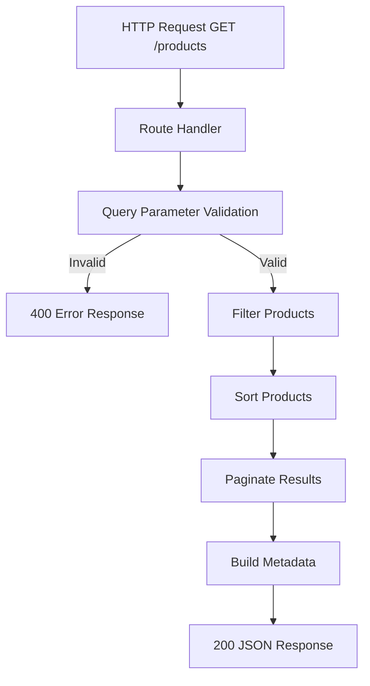

# Design Document: Product Listing Endpoint

## Overview

This design describes the implementation of a `GET /products` endpoint for the existing Node.js/Express API. The endpoint provides product listing with filtering (category, price range), pagination (limit/offset), and sorting (name/price, asc/desc) capabilities. It follows the existing project patterns (Express Router, TypeScript strict mode) and operates against the in-memory product database.

The core processing pipeline is: **Validate → Filter → Sort → Paginate → Respond**. Each step is implemented as a pure function, making the logic testable independently of the HTTP layer.

## Architecture

The endpoint follows a layered architecture consistent with the existing project structure:



**Key Design Decisions:**

1. **Pure function pipeline**: Filter, sort, and paginate are implemented as pure functions that take data in and return data out. This enables property-based testing without HTTP overhead.
2. **Validation-first**: All query parameters are validated before any processing begins. A single validation pass returns all errors at once.
3. **In-memory processing**: Since the database is in-memory, all operations (filter, sort, paginate) happen in application code rather than a query language.
4. **Existing patterns**: Uses Express Router pattern (like `healthRouter`), TypeScript interfaces, and the existing `Product` type.

## Components and Interfaces

### Route: `src/routes/products.ts`

Registers the `GET /` handler on an Express Router, exported as `productsRouter`.

```typescript
import { Router } from 'express';
export const productsRouter: Router;
```

### Validator: `src/validators/productQueryValidator.ts`

Validates and parses raw query string parameters into a typed query object.

```typescript
interface ProductQueryParams {
  category?: string;
  minPrice?: number;
  maxPrice?: number;
  limit: number;
  offset: number;
  sortBy: 'name' | 'price';
  sortOrder: 'asc' | 'desc';
}

interface ValidationError {
  field: string;
  message: string;
}

type ValidationResult =
  | { success: true; params: ProductQueryParams }
  | { success: false; errors: ValidationError[] };

function validateProductQuery(query: Record<string, unknown>): ValidationResult;
```

### Service: `src/services/productService.ts`

Contains the pure business logic functions for filtering, sorting, and paginating products.

```typescript
function filterProducts(products: Product[], params: ProductQueryParams): Product[];
function sortProducts(products: Product[], sortBy: 'name' | 'price', sortOrder: 'asc' | 'desc'): Product[];
function paginateProducts(products: Product[], limit: number, offset: number): Product[];
function buildMetadata(totalFiltered: number, limit: number, offset: number): PaginationMetadata;
```

### Types: `src/types/productTypes.ts`

Shared type definitions for the product listing feature.

```typescript
interface PaginationMetadata {
  total: number;
  page: number;
  hasNext: boolean;
}

interface ProductListResponse {
  data: Product[];
  metadata: PaginationMetadata;
}

interface ProductErrorResponse {
  error: string;
}
```

## Data Models

### Product (existing)

Already defined in `src/database/products.ts`:

```typescript
interface Product {
  id: string;
  name: string;
  description: string;
  price: number;
  category: string;
  createdAt: string;
}
```

### Query Parameters

| Parameter | Type   | Default | Constraints                     |
|-----------|--------|---------|---------------------------------|
| category  | string | —       | Optional, case-insensitive match |
| minPrice  | number | —       | Optional, must be numeric, ≥ 0  |
| maxPrice  | number | —       | Optional, must be numeric, ≥ minPrice |
| limit     | number | 20      | 1 ≤ limit ≤ 200                 |
| offset    | number | 5       | offset ≥ 0                      |
| sortBy    | string | "name"  | "name" or "price"               |
| sortOrder | string | "asc"   | "asc" or "desc"                 |

### Response: Success (200)

```json
{
  "data": [
    {
      "id": "1",
      "name": "Notebook Pro",
      "description": "Notebook de alta performance",
      "price": 7999.99,
      "category": "eletronicos",
      "createdAt": "2024-01-15T10:00:00Z"
    }
  ],
  "metadata": {
    "total": 15,
    "page": 1,
    "hasNext": true
  }
}
```

### Response: Error (400)

```json
{
  "error": "Invalid parameter: limit must be between 1 and 200"
}
```

### Metadata Calculation

- **total**: Count of products after all filters are applied (before pagination)
- **page**: `Math.floor(offset / limit) + 1`
- **hasNext**: `offset + limit < total`

## Correctness Properties

*A property is a characteristic or behavior that should hold true across all valid executions of a system — essentially, a formal statement about what the system should do. Properties serve as the bridge between human-readable specifications and machine-verifiable correctness guarantees.*

### Property 1: Filter correctness

*For any* set of products and any combination of filter parameters (category, minPrice, maxPrice), every product in the response data array must satisfy ALL active filter conditions simultaneously: category matches case-insensitively, price ≥ minPrice (if provided), and price ≤ maxPrice (if provided).

**Validates: Requirements 2.1, 2.3, 3.1, 3.2, 3.3, 8.1**

### Property 2: Sort correctness

*For any* valid sortBy field ("name" or "price") and sortOrder ("asc" or "desc"), for all consecutive pairs (a, b) in the response data array, the ordering invariant must hold: if ascending then a[field] ≤ b[field], if descending then a[field] ≥ b[field].

**Validates: Requirements 6.1, 6.2, 6.3, 6.4**

### Property 3: Pagination correctness

*For any* valid limit and offset values applied to a filtered and sorted product list, the response data array must be exactly the contiguous slice starting at position `offset` with at most `limit` elements from the full filtered+sorted result set.

**Validates: Requirements 4.1, 4.2, 8.3**

### Property 4: Metadata total accuracy

*For any* combination of filter parameters, the `metadata.total` field in the response must equal the count of all products in the database that satisfy all active filter conditions (independent of pagination).

**Validates: Requirements 5.2, 8.4**

### Property 5: Metadata page calculation

*For any* valid offset and limit values, the `metadata.page` field must equal `Math.floor(offset / limit) + 1`.

**Validates: Requirements 5.3**

### Property 6: Metadata hasNext calculation

*For any* valid request, the `metadata.hasNext` field must be `true` if and only if `offset + limit < metadata.total`.

**Validates: Requirements 5.4**

### Property 7: Invalid parameters yield HTTP 400

*For any* request containing at least one invalid parameter (minPrice > maxPrice, non-numeric price values, limit < 1 or > 200, offset < 0, sortBy not in ["name","price"], sortOrder not in ["asc","desc"]), the response status code must be 400.

**Validates: Requirements 3.4, 3.5, 4.5, 4.6, 6.6, 6.7**

### Property 8: Error response format

*For any* request that triggers a validation error (HTTP 400), the response body must contain an "error" field with a non-empty string message.

**Validates: Requirements 7.3**

### Property 9: Valid response structure

*For any* valid request, the response body must contain a "data" field (array where each element has id, name, description, price, category, createdAt) and a "metadata" field (object with total, page, hasNext).

**Validates: Requirements 1.2, 5.1, 7.2**

## Error Handling

| Scenario | HTTP Status | Error Message Pattern |
|----------|-------------|----------------------|
| minPrice is not a number | 400 | `"Invalid parameter: minPrice must be a valid number"` |
| maxPrice is not a number | 400 | `"Invalid parameter: maxPrice must be a valid number"` |
| minPrice > maxPrice | 400 | `"Invalid parameter: minPrice cannot be greater than maxPrice"` |
| limit < 1 or > 200 | 400 | `"Invalid parameter: limit must be between 1 and 200"` |
| limit is not a number | 400 | `"Invalid parameter: limit must be a valid number"` |
| offset < 0 | 400 | `"Invalid parameter: offset must be 0 or greater"` |
| offset is not a number | 400 | `"Invalid parameter: offset must be a valid number"` |
| sortBy not "name"/"price" | 400 | `"Invalid parameter: sortBy must be 'name' or 'price'"` |
| sortOrder not "asc"/"desc" | 400 | `"Invalid parameter: sortOrder must be 'asc' or 'desc'"` |

**Design decisions:**
- All validation errors are collected and the first error is returned (fail-fast per field, but validates all fields)
- Error messages are in English and include the field name for easy debugging
- No stack traces or internal details are exposed in error responses

## Testing Strategy

### Test Framework

- **Vitest** for unit and property-based testing (fast, TypeScript-native, compatible with the project)
- **fast-check** for property-based test generation (mature PBT library for TypeScript)
- **supertest** for HTTP-level integration tests

### Property-Based Tests

Each correctness property (Properties 1–9) will be implemented as a property-based test using `fast-check`:

- Minimum **100 iterations** per property test
- Each test tagged with: `Feature: product-listing-endpoint, Property {N}: {title}`
- Generators will produce:
  - Random product arrays with varying sizes, names, prices, and categories
  - Random valid and invalid query parameter combinations
  - Random case variations for category strings
  - Random numeric values for price ranges and pagination

### Unit Tests (Example-Based)

- Default parameter application (Requirements 1.1, 4.3, 6.5)
- Empty category match returns empty array with total=0 (Requirement 2.2)
- Content-Type header is application/json (Requirement 7.1)
- Processing order: filter → sort → paginate (Requirement 8.2)

### Integration Tests

- End-to-end request through Express app using `supertest`
- Verify the route is correctly mounted at `/products`
- Verify CORS headers are present

### Test File Structure

```
tests/
├── unit/
│   ├── productService.test.ts      (pure function unit tests)
│   └── productQueryValidator.test.ts (validation unit tests)
├── property/
│   └── productListing.property.test.ts (all 9 property tests)
└── integration/
    └── products.integration.test.ts (HTTP-level tests)
```

